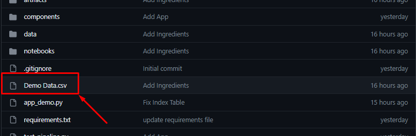
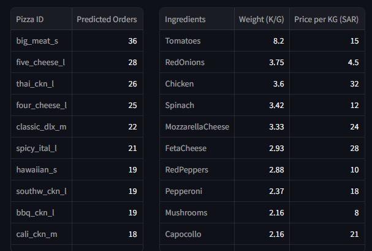

# DemandGuru
Welcome to **DemandGuru** Repository

## How to use the App?
1. Download "Demo Data.csv" .
2. Go to our website [link](https://demandguru.streamlit.app/)
3. Upload the data and click on show results.
4. Two table will will 
    - The first table shows predicted number of orders for pizza.
    - The second table shows how much ingredients we need.

## Demo Video

https://github.com/AhmadHammad21/DemandGuru/assets/77201365/5e1e8d19-aa36-4005-86c4-bf6f9445a309

